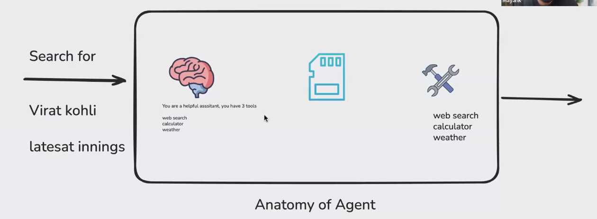
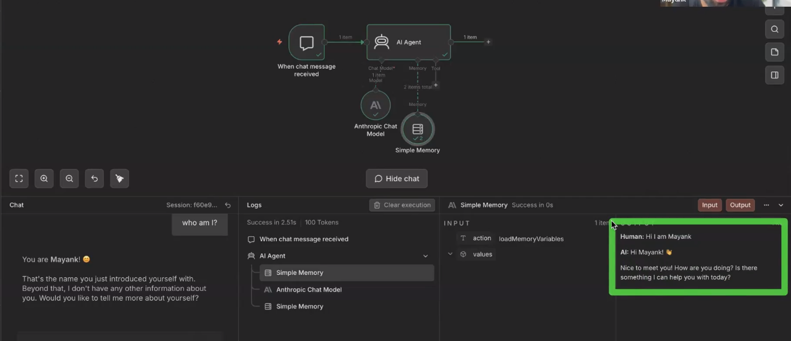
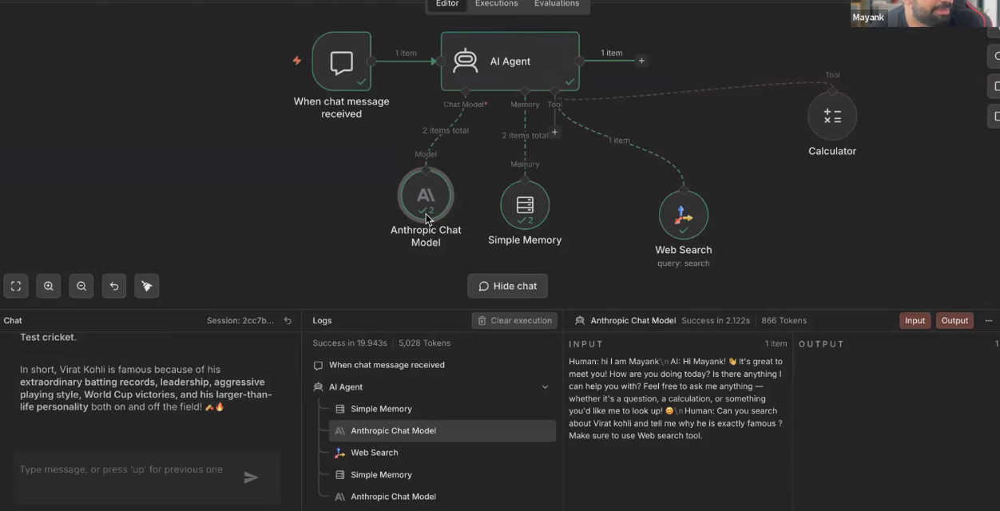

# 🟢 Agent

* <mark style="color:purple;background-color:purple;">**LLM + Memory + Tools**</mark>
*

    <figure><figcaption></figcaption></figure>
* <mark style="color:purple;background-color:purple;">**Agent will 1st check the memory, then check the message**</mark>
* <mark style="color:purple;background-color:purple;">**If we ask a query for which a tool call is needed, then LLM will call the tool, get the repsonse and then LLM will answer the query — Here LLM will be called twice**</mark>
* <mark style="color:purple;background-color:purple;">**And once its done, it will update the memory**</mark>
*

    <figure><figcaption></figcaption></figure>
*

    <figure><figcaption></figcaption></figure>
