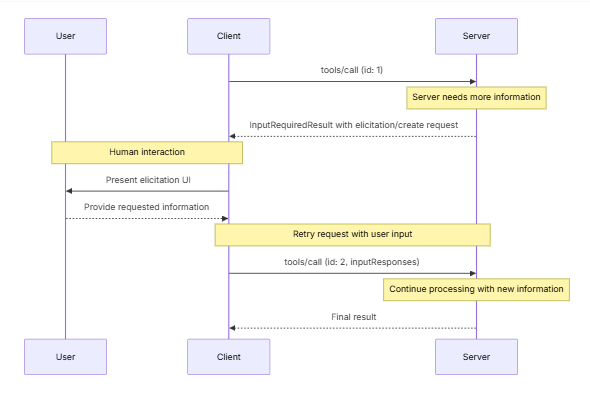

# 🟢 Client

* <mark style="color:red;background-color:purple;">**Instantiated by host applications to communicate with particular MCP servers**</mark>
* <mark style="color:purple;background-color:purple;">Each client handles one direct communication with one server.</mark>
* <mark style="color:red;background-color:purple;">**Clients may provide several features to servers**</mark>

<mark style="color:red;background-color:purple;">**Elicitation:**</mark>

* <mark style="color:red;background-color:purple;">**Provides a structured way for servers to gather necessary information on demand.**</mark>&#x20;
* <mark style="color:purple;background-color:purple;">Instead of requiring all information up front or failing when data is missing, servers can pause their operations to request specific inputs from users.</mark>
* <mark style="color:purple;background-color:purple;">Modes:</mark>
  * <mark style="color:red;background-color:purple;">**Form Mode:**</mark>
    * <mark style="color:red;background-color:purple;">**The server asks the client to collect structured data from the user.**</mark>&#x20;
    * <mark style="color:red;background-color:purple;">**The request includes a schema that the client uses to build an input form and validate the response**</mark>
  * <mark style="color:red;background-color:purple;">**URL Mode:**</mark>
    * <mark style="color:red;background-color:purple;">**The server provides a URL for the user to open**</mark>
    * <mark style="color:red;background-color:purple;">**Data never passes through the client, which makes this mode suitable for sensitive flows such as credential entry**</mark>

<mark style="color:purple;background-color:purple;">**Benefits of 1:1 Client: Server:**</mark>

* <mark style="color:red;background-color:purple;">**Scalability**</mark>
* <mark style="color:red;background-color:purple;">**Parallelism**</mark>
* <mark style="color:red;background-color:purple;">**Security**</mark>

<mark style="color:purple;background-color:purple;">**Flow:**</mark>

<figure><figcaption></figcaption></figure>

