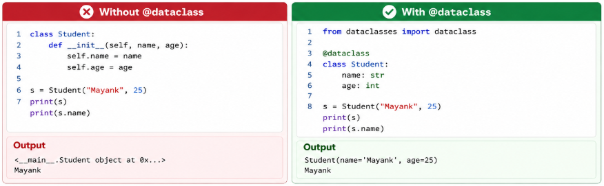

# 🟢 @dataclass

* `@dataclass` is a <mark style="color:purple;background-color:purple;">**decorator that automatically generates common methods for a class.**</mark>
* It removes boilerplate code like writing `__init__()` manually.
* <mark style="color:purple;background-color:purple;">**You only define the attributes; Python creates the rest.**</mark>
* <mark style="color:purple;background-color:purple;">**Best used for classes that mainly hold data.**</mark>
* In Agentic AI, it's useful for representing structured objects like agent state, messages, configurations, and tool inputs. Later, you'll learn Pydantic, which extends this concept with data validation.
* Frameworks like Pydantic are built on top of this idea, adding validation, serialization, and parsing—essential for LLM structured outputs and tool calling
*

    <figure><figcaption></figcaption></figure>
