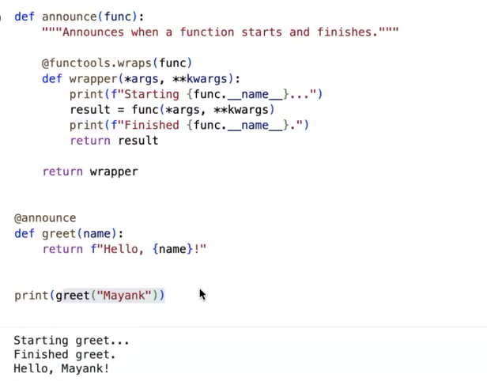

# @decorator

* In Agentic AI, decorators are commonly used to **register tools**
* Function is wrapped inside the decorator function
*   When the decorated function is called, the `wrapper()` function executes first. Inside the wrapper, the original function (`func`) is called, and its result is returned

    <figure><figcaption></figcaption></figure>
