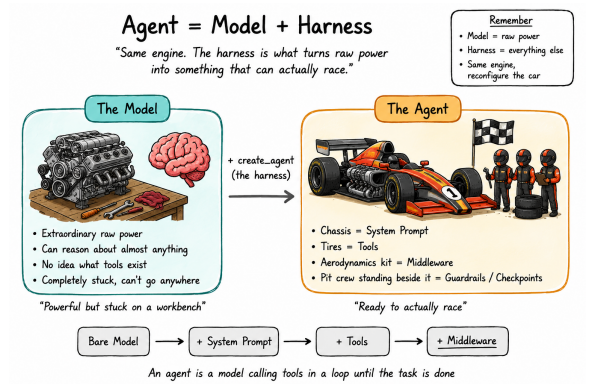

# 🟢 Harness

* <mark style="color:purple;background-color:purple;">**Agent = Model + Harness**</mark>
* <mark style="color:purple;background-color:purple;">**Harness ⇒ System prompt, Tools, Middleware, Guardrails, Checkpoints ⇒ Harness**</mark>
*

    <figure><figcaption></figcaption></figure>
