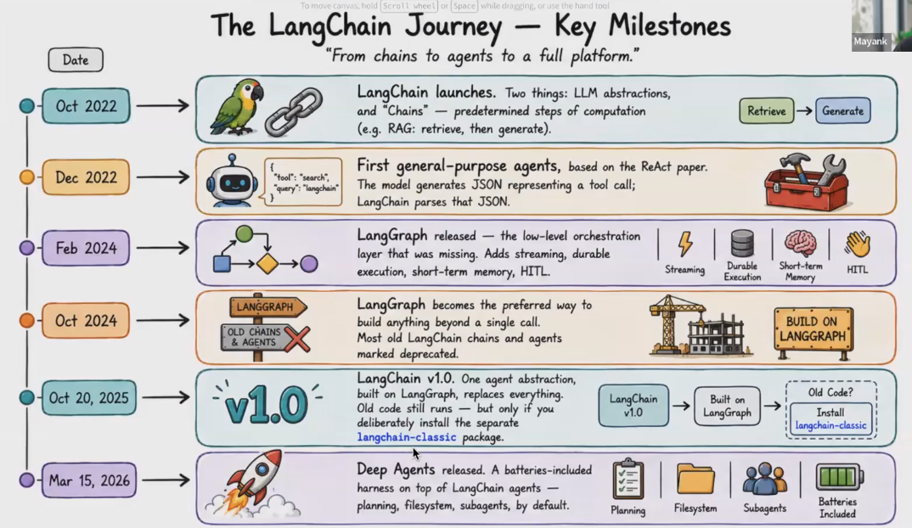

# 🟢 LangChain Journey

* LangChain 1.0 released in Oct 2025 ⇒ This needs to be used...Older langchain is deprecated now&#x20;
* <mark style="color:purple;background-color:purple;">**More customization is possible in low level (LangGraph)**</mark>
* In LangGraph we can have ⇒ Streaming, durable execution, memory and human in the loop

<mark style="color:purple;background-color:purple;">**Timeline:**</mark>

* <mark style="color:purple;background-color:purple;">**LangChain (abstraction + chain)**</mark>
* <mark style="color:purple;background-color:purple;">**React agent (Reason + Act)**</mark>
* <mark style="color:purple;background-color:purple;">**LangGraph ⇒ More control as it's low level**</mark>
* <mark style="color:purple;background-color:purple;">**LangChain v1 released**</mark>
  * <mark style="color:purple;background-color:purple;">**Built on langgraph**</mark>
  * <mark style="color:purple;background-color:purple;">**langchain classic becomes legacy**</mark>
* <mark style="color:purple;background-color:purple;">**Deep agents released**</mark>
*

    <figure><figcaption></figcaption></figure>
