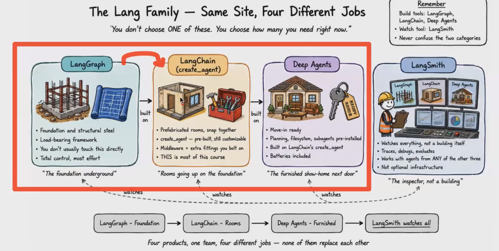

# 🟢 Lang Family

* <mark style="color:purple;background-color:purple;">**LangGraph, LangChain, DeepAgents ⇒  Building agents**</mark>
* <mark style="color:purple;background-color:purple;">**LangChain is built on top of LangGraph**</mark>
*   LangSmith ⇒ Observability

    <figure><figcaption></figcaption></figure>
