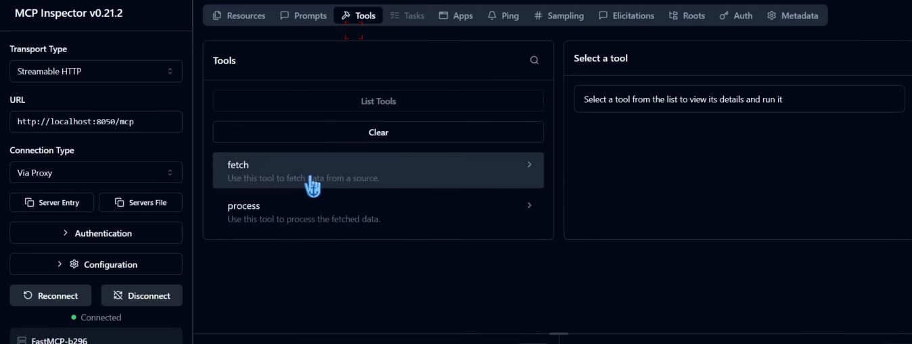

# MCP Inspector

* We need node for this
* node -v
* npm -v
* npx -v
* npm init
* give package name
* npx @modelcontextprotocol/inspector
* This will open
*   We can also create resource, prompts in our MCP...But mostly everyone just create tools in MCP

    <figure><figcaption></figcaption></figure>
