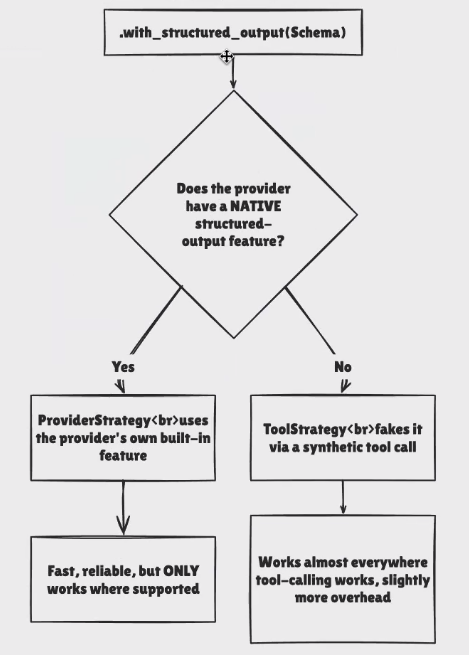

# Provider Strategy and Tool Startegy

* Some model providers support structured output natively through their APIs (e.g. OpenAI, xAI (Grok), Gemini, Anthropic (Claude)).&#x20;
* This is the most reliable method when available
  * we can init a model then do model.profile and check the response json to know whether the model supports it or not
* If the model doesn't support then we will be using tool strategy
* LangChain automatically uses `ProviderStrategy` when you pass a schema type directly to [`create_agent.response_format`](https://reference.langchain.com/python/langchain/agents/factory/create_agent) and the model supports native structured output:
*

    <figure><figcaption></figcaption></figure>

