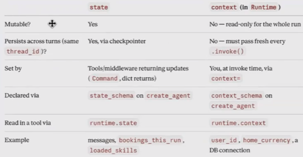

# 🔴 State vs Runtime vs Context

State:

* Conversation History
* Any overall variable
* We can create our own state by expanding or inheriting the agent state

<figure><figcaption></figcaption></figure>
