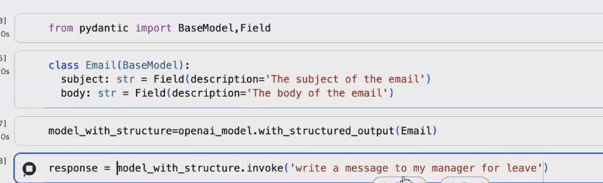

# Structured Model

* Just like how we validated field and data validation, similarly we should have model output also in a structured format
*

    <figure><figcaption></figcaption></figure>
* Now the response will be of type Email, so if its getting used anywhere then it will not fail
*
