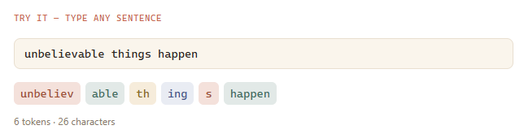

# Token

* Before a model can predict anything, your sentence gets broken into chunks — not full words, not single letters, but pieces landed on during training.&#x20;
* Short, common words often become a single piece. Longer or unusual words get split into two or three.
* Output tokens are expensive than input tokens
*

    <figure><figcaption></figcaption></figure>
