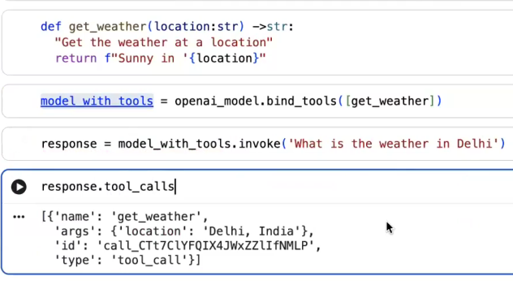

# 🟢 Tools & Models

* <mark style="color:purple;background-color:purple;">**We create functions**</mark>
* <mark style="color:purple;background-color:purple;">**We bind this functions as tools to the model**</mark>
* <mark style="color:purple;background-color:purple;">**response.tools ⇒ We will get tool name which will get called and with which arguments**</mark>
* <mark style="color:purple;background-color:purple;">**So we get the output or we get the tool which needs to be called**</mark>
*

    <figure><figcaption></figcaption></figure>

    <figure><figcaption></figcaption></figure>
