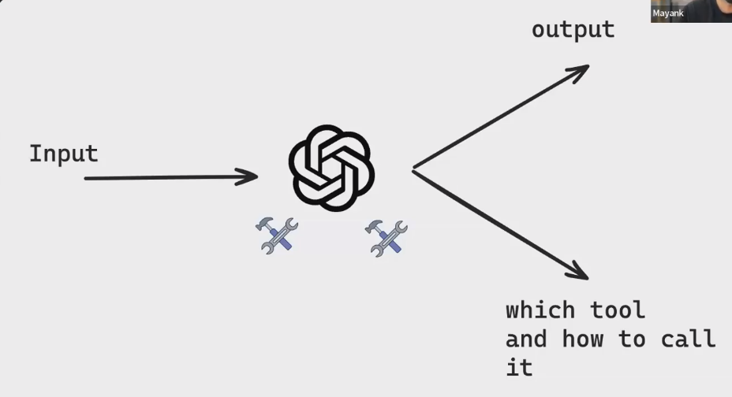

# Tools & Models

* We create functions
* We bind this functions as tools to the model
* response.tools ⇒ We will get tool name which will get called and with which arguments
*

    <figure><figcaption></figcaption></figure>
