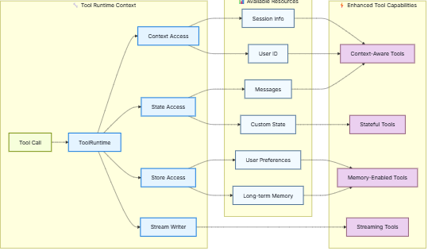

# 🔴 Tools - Runtime

* A runtime param in tool which our tool can use to read lot of things
* Our tool can only see args
* Runtime information like conversation history, user data, and persistent memory
*

    <figure><figcaption></figcaption></figure>
* If the tools have context then they perform better
*

    <figure><figcaption></figcaption></figure>
* **Context aware tools:**
  * We can create 2 tools
    * 1st is saving the data into store memory&#x20;
    * 2nd is for fecthing the data from the store memory

```python
```

*

