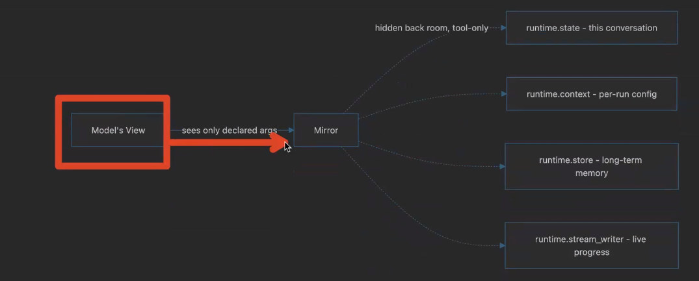

# 🔴 Tools - Runtime

* A runtime param in tool which our tool can use to read lot of things
* Our tool can only see args
* Runtime information like conversation history, user data, and persistent memory
*

    <figure><figcaption></figcaption></figure>
*

