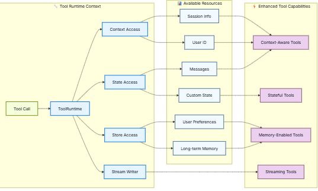

# 🟢 Tools

* <mark style="color:purple;background-color:purple;">**Tools extend what**</mark> [<mark style="color:purple;background-color:purple;">**agents**</mark>](https://docs.langchain.com/oss/python/langchain/agents) <mark style="color:purple;background-color:purple;">**can do—letting them fetch real-time data, execute code, query external databases, and take actions in the world.**</mark>
* <mark style="color:purple;background-color:purple;">**They are just callable function with @tool decorator**</mark>
* <mark style="color:purple;background-color:purple;">**The function’s docstring becomes the tool’s description that helps the model understand when to use it**</mark>
* <mark style="color:purple;background-color:purple;">**Type hints are required as they define the tool’s input schema.**</mark>
* <mark style="color:purple;background-color:purple;">**@tool("calculator", description="Performs arithmetic calc ⇒ To give custom name and description**</mark>
* <mark style="color:red;background-color:purple;">**config, runtime ⇒ cannot be used in parameters in tool**</mark>**&#x20;**<mark style="color:purple;background-color:purple;">**⇒ It will give when the tool gets called by agent**</mark>
* <mark style="color:purple;background-color:purple;">**Tools are most powerful when they can access runtime information like conversation history, user data, and persistent memory ⇒ This can be access using**</mark>**&#x20;**<mark style="color:red;background-color:purple;">**ToolRunTime which is passed by the framework to the tool**</mark>**&#x20;**<mark style="color:purple;background-color:purple;">**which has below fields**</mark>
* <mark style="color:red;background-color:purple;">**We can also define a pydantic schema and then pass it in args\_schema in @tool**</mark>
*

    <figure><figcaption></figcaption></figure>

    *

        | Component                                                           | Description                                                                                                                            | Use case                                                                                                                                                                                                                                                                        |
        | ------------------------------------------------------------------- | -------------------------------------------------------------------------------------------------------------------------------------- | ------------------------------------------------------------------------------------------------------------------------------------------------------------------------------------------------------------------------------------------------------------------------------- |
        | <mark style="color:red;background-color:purple;">**State**</mark>   | <mark style="color:red;background-color:purple;">**Short-term memory**</mark>                                                          | <mark style="color:red;background-color:purple;">**It includes the message history and any custom fields you define in your**</mark> [<mark style="color:red;background-color:purple;">**graph state**</mark>](https://docs.langchain.com/oss/python/langgraph/graph-api#state) |
        | <mark style="color:red;background-color:purple;">**Context**</mark> | <mark style="color:red;background-color:purple;">**Immutable configuration passed at invocation time (user IDs, session info)**</mark> | <mark style="color:red;background-color:purple;">**Personalize responses based on user identity**</mark>                                                                                                                                                                        |
        | <mark style="color:red;background-color:purple;">**Store**</mark>   | <mark style="color:red;background-color:purple;">**Long-term memory - persistent data that survives across conversations**</mark>      | <mark style="color:red;background-color:purple;">**Save user preferences, maintain knowledge base**</mark>                                                                                                                                                                      |
        | **Stream Writer**                                                   | Emit real-time updates during tool execution                                                                                           | Show progress for long-running operations                                                                                                                                                                                                                                       |
        | **Execution Info**                                                  | Identity and retry information for the current execution (thread ID, run ID, attempt number)                                           | Access thread/run IDs, adjust behavior based on retry state                                                                                                                                                                                                                     |
        | **Server Info**                                                     | Server-specific metadata when running on LangGraph Server (assistant ID, graph ID, authenticated user)                                 | Access assistant ID, graph ID, or authenticated user info                                                                                                                                                                                                                       |
        | **Config**                                                          | [`RunnableConfig`](https://reference.langchain.com/python/langchain-core/runnables/config/RunnableConfig) for the execution            | Access callbacks, tags, and metadata                                                                                                                                                                                                                                            |
        | **Tool Call ID**                                                    | Unique identifier for the current tool invocation                                                                                      | Correlate tool calls for logs and model invocations                                                                                                                                                                                                                             |

```python
from langchain.tools import tool

@tool
def search_database(query: str, limit: int = 10) -> str:
    """Search the customer database for records matching the query.

    Args:
        query: Search terms to look for
        limit: Maximum number of results to return
    """
    return f"Found {limit} results for '{query}'"
```

```python
from pydantic import BaseModel, Field
from typing import Literal

class WeatherInput(BaseModel):
    """Input for weather queries."""
    location: str = Field(description="City name or coordinates")
    units: Literal["celsius", "fahrenheit"] = Field(
        default="celsius",
        description="Temperature unit preference"
    )
    include_forecast: bool = Field(
        default=False,
        description="Include 5-day forecast"
    )

@tool(args_schema=WeatherInput)
def get_weather(location: str, units: str = "celsius", include_forecast: bool = False) -> str:
    """Get current weather and optional forecast."""
    temp = 22 if units == "celsius" else 72
    result = f"Current weather in {location}: {temp} degrees {units[0].upper()}"
    if include_forecast:
        result += "\nNext 5 days: Sunny"
    return result
```

<mark style="color:purple;background-color:purple;">**Headless Tools:**</mark>

* <mark style="color:purple;background-color:purple;">**Use them when the work depends on the environment, device, or UI that only exists on the client.**</mark>
* <mark style="color:purple;background-color:purple;">**A headless tool is schema-only, with no in-process implementation.**</mark>
* <mark style="color:purple;background-color:purple;">**Instead of running locally, the graph pauses**</mark>
* <mark style="color:purple;background-color:purple;">**Resume the graph after your app, another service, or a human step performs the action.**</mark>
