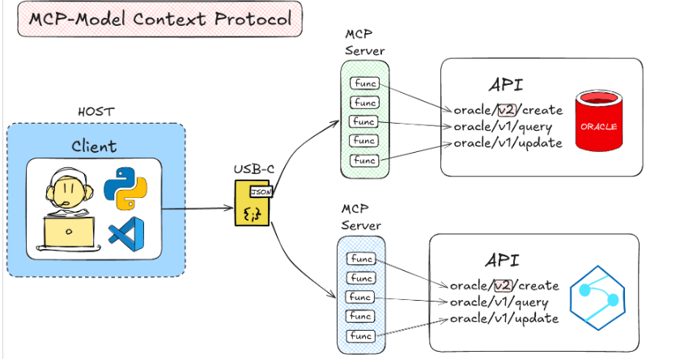

# Why MCP

**Before MCP:**

* &#x20;We talk with Oracle using APIs
* As a developer we will be writing our own logic to connect to APIs&#x20;
* Lets say oracle update v1 to v2
* We might have to update the logic as well if there is some change in metadata
* We might be using other services like Azure as well
* For that we might be writing different logic and connection details as well
* Everytime for we have to write different code for connecting to different services
* This is difficult now that we connect to different services and then who will be keep checking this
*

    <figure><figcaption></figcaption></figure>

**MCP: Model context protocol:**

* Oracle will provide MCP server
* It will have functions
* We can connect to MCP directly
* We don't directly connect to MCP, we configure it using a json
*

    <figure><figcaption></figcaption></figure>
